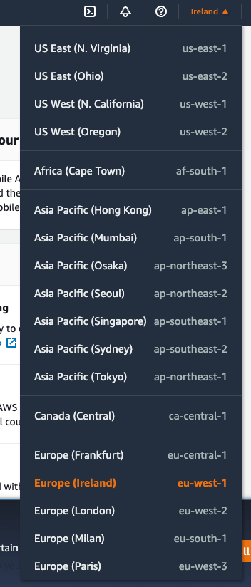
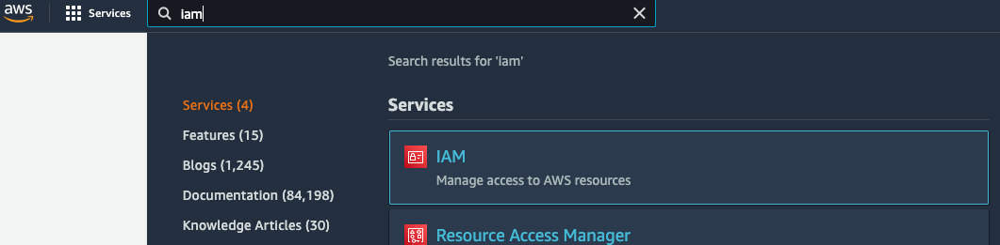
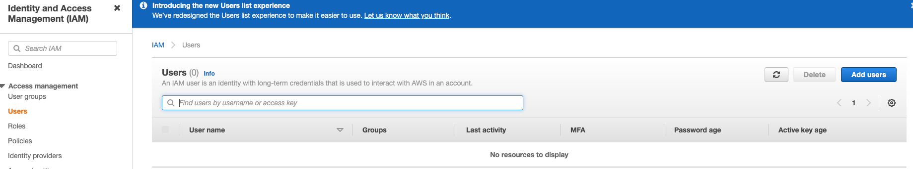
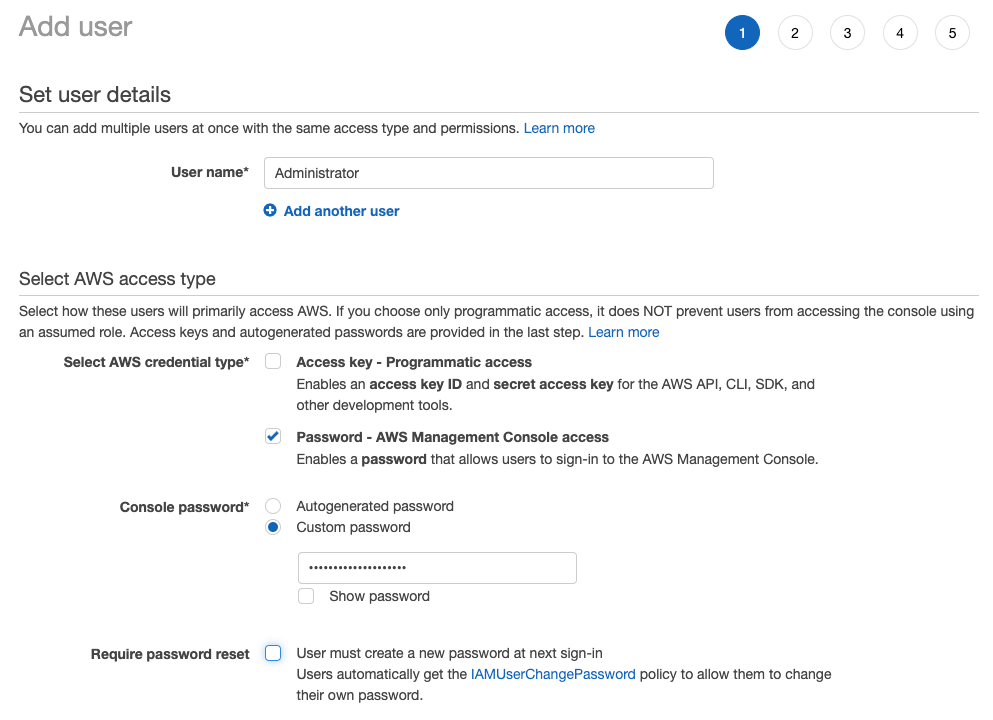
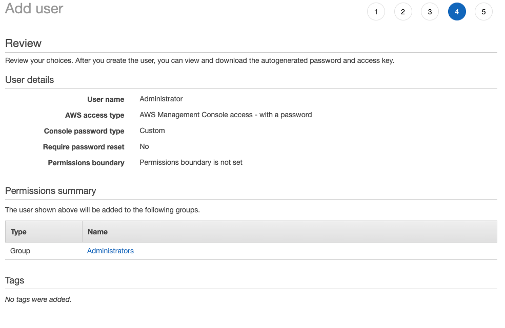
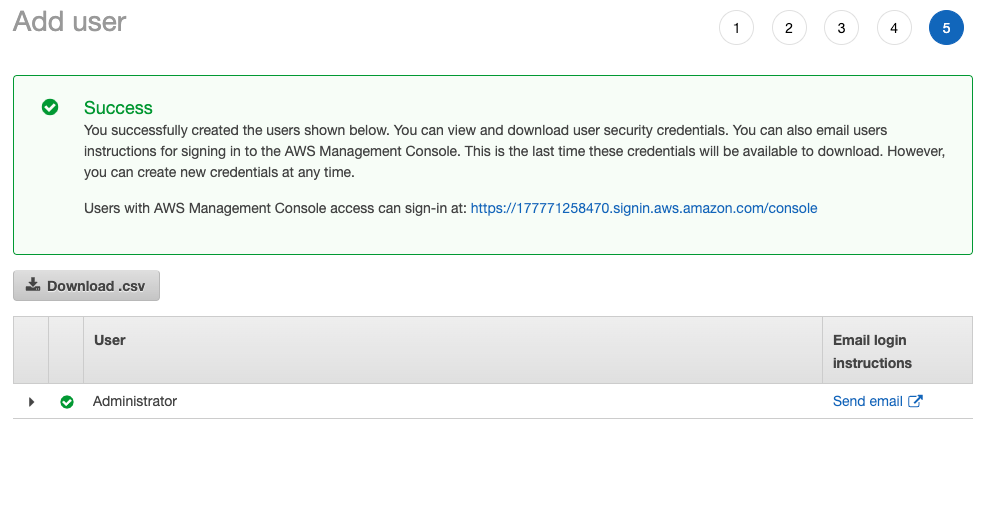
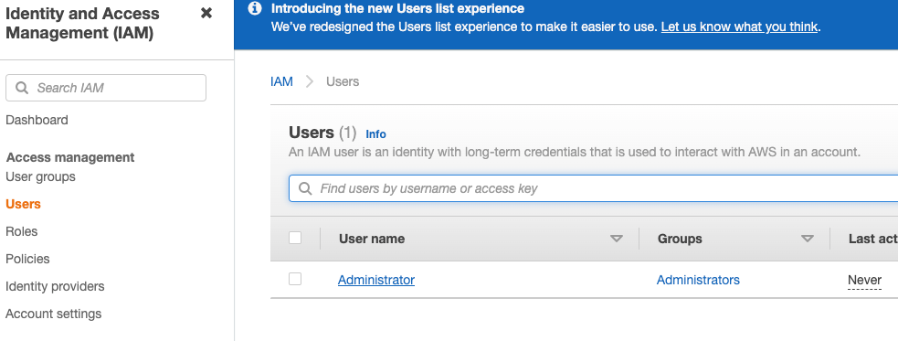
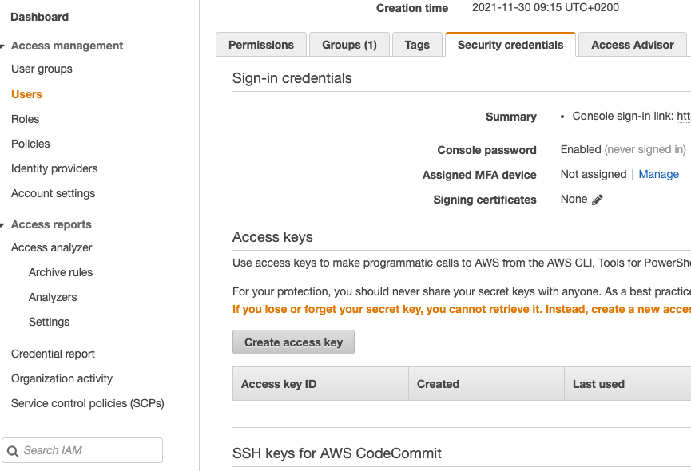
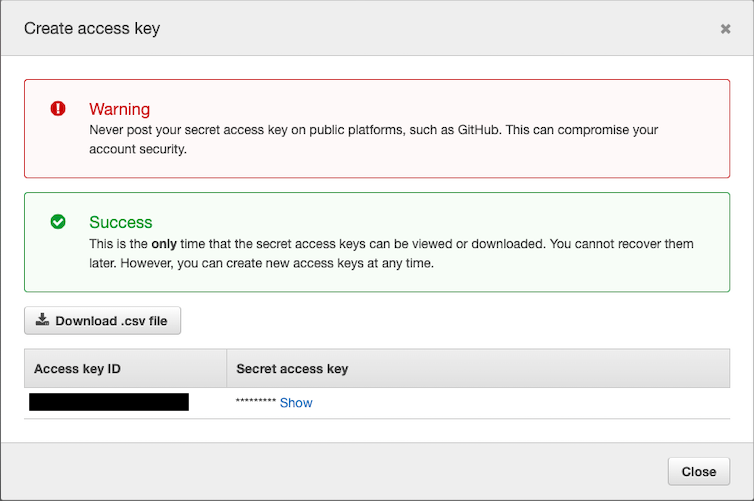

# Introduction

### What happens behind the scenes from the moment you type a DNS till you get the website rendered in your browser?

You open a browser, type in `www.google.com` and you see Google's search input. How does that happen?
```
Q: What is a browser? 

A: A client application installed on my device.
```
```
Q: Where does the browser get the pages to render? 

A: From a server.
```
```
Q: How does a client application request something from a server? 

A: It needs to know the IP address of the server and the communication protocol (e.g. HTTP).
```
```
Q: How does the browser get the IP?

A: Via the DNS servers.
```
```
Q: How does the request made by the browser to the server look like?

A: Considering a HTTP call it would be a GET for an index.html file, followed by subsequent 
requests for all the dependencies found in the file (e.g. *.css, *.js).
```
```
Q: What does the server need to be in order to handle such a request?

A: It needs to understand the HTTP protocol and it needs to have a file system (FS) on which
the index.hml, *.css, *.js files exist.
```
This is how it all looks like <br>


```
Q: What happens once you type in something for Google to search? 

A: A request is made to www.google.com/complete/search?q=<...>. This is an AJAX call. In 
order to be able to satisfy this the server now needs an application server and most likely
some sort of data storage.
```
This picture now looks like <br>


### What is Cloud?
"Cloud computing is the on-demand availability of computer system resources, especially data storage (cloud storage) and computing power, without direct active management by the user." ([Wikipedia](https://en.wikipedia.org/wiki/Cloud_computing))

### What are some Cloud providers?
* Amazon - Amazon Web Services
* Microsoft - Microsoft Azure
* Google - Google Cloud

### Explore the AWS console
AWS has multiple data centers in different regions of the world, and you can choose the one that best suites you. Sometimes that can mean the closest to you but you also need to consider the fact that not all services are available in all regions. The ones in which AWS guarantees to have full availability are **us-east-1** and **eu-west-1**. We will be using **Europe(Ireland) - eu-west-1**.

In order to select your region go to the top right corner, next to your account name. <br>

**_!!! You will have to select your region every time you log in._** <br>

### Overview of the AWS services
### Create an AWS free account
* Option 1 - [AWS Educate](https://aws.amazon.com/education/awseducate/)
* Option 2 - [AWS Free Tier](https://aws.amazon.com/free/?trk=ps_a134p000003yjttAAA&trkCampaign=acq_paid_search_brand&sc_channel=PS&sc_campaign=acquisition_EEM&sc_publisher=Google&sc_category=Core&sc_country=EEM&sc_geo=EMEA&sc_outcome=acq&sc_detail=free%20aws%20account&sc_content=Account_e&sc_segment=453071975038&sc_medium=ACQ-P|PS-GO|Brand|Desktop|SU|AWS|Core|EEM|EN|Text|xx|EU&s_kwcid=AL!4422!3!453071975038!e!!g!!free%20aws%20account&ef_id=Cj0KCQiAkZKNBhDiARIsAPsk0WgC0ZJLCqoaZCnrqWOkUbkp0yKXgTZPGIFKcagh2Ks64Y1YYWGwYG8aAtbsEALw_wcB:G:s&s_kwcid=AL!4422!3!453071975038!e!!g!!free%20aws%20account&all-free-tier.sort-by=item.additionalFields.SortRank&all-free-tier.sort-order=asc&awsf.Free%20Tier%20Types=*all&awsf.Free%20Tier%20Categories=*all) (you need a debit/credit card for this)
### AWS CLI
Follow the installation [guide](https://docs.aws.amazon.com/cli/latest/userguide/getting-started-install.html).

In order to use the CLI you need an access key ID and a secret access key. In order to do that follow the instructions:

#### Create an Administrator User
1. Go to AWS IAM (Identity Access Management) - this is where users and permissions are managed <br>

2. In the left navigation panel select **Users** and then clikc on **Add users** <br>

3. Set the username as **Administrator** and the rest of the settings like in the image bellow <br>

4. Select **Add user to group**, then **Create group** and configure the new group as follows <br>

5. No need to add any tags
6. The review step should look like this

7. Click **Create user**
8. Download the `.csv`


#### Create access key for user
1. Go to IAM -> Users and click on **Administrator** 

2. Under **Security credentials** click on **Create access key**

3. Download the `.csv` file. **!!! This is the only time you can do this**



Once you have the credentials you need to configure the CLI so that it knows about them. Instructions [here](https://docs.aws.amazon.com/cli/latest/userguide/getting-started-quickstart.html). We will be using the `eu-west-1` region.
### AWS SDK
Apart from a CLI which is great for creating scripts that manages the resources needed for your project, AWS also provides SDKs for various languages like: Java, C++, Python, Javascript, Typescript.

The SDK is useful for when your application needs to interact with an AWS service, like for example storing something in a DynamoDB.
