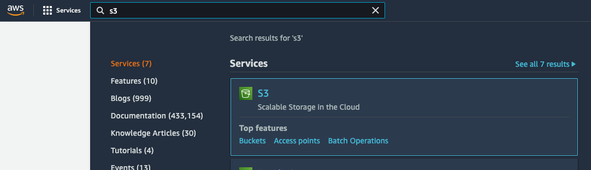
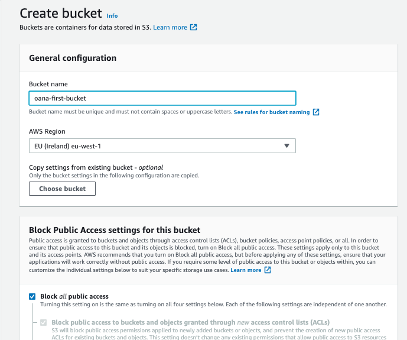
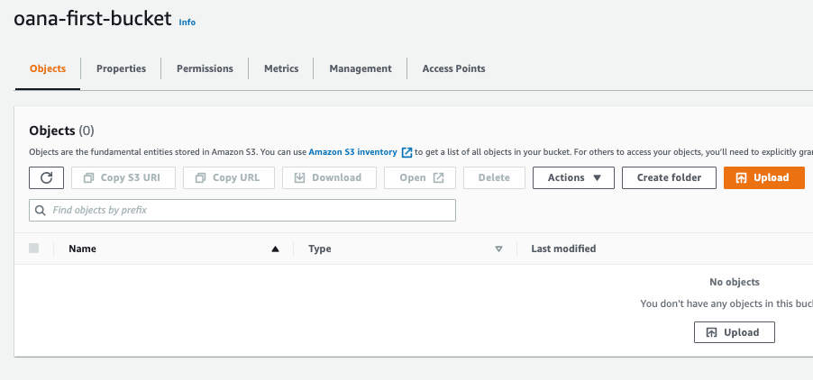
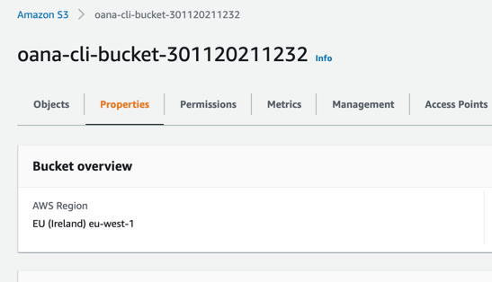
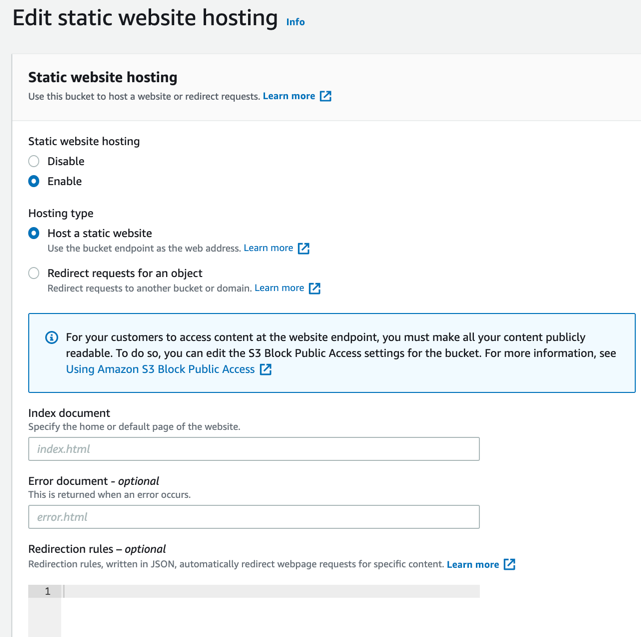
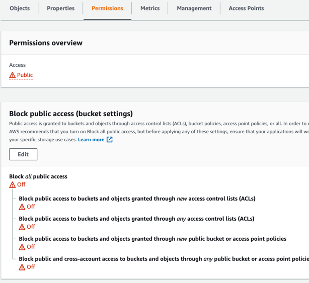

# Host a website on AWS S3

### Overview of S3
S3 stands for Simple Storage Service. It is an "object storage service that stores data as **objects** within **buckets**. An object is a file and any metadata that describes the file. A bucket is a container for objects." ([docs](https://docs.aws.amazon.com/AmazonS3/latest/userguide/Welcome.html))

A bucket name must be unique in its partition (a collection of regions). Objects can be folders or files.

A bucket can be configured with versioning which means that it will not replace an object, rather it will create a new version of it. Previous versions of an object can be accessed and restored if necessary. By default, versioning is disabled.

AWS allows bucket owners to set **policies** that control access to the bucket.

Once a file was uploaded in a bucket it has a link that can be used to access it. Only those that have been granted access through the bucket policy can access the link.

### Creating a bucket

#### Via Console
1. Head over to the S3 service

2. Click **Create bucket**
3. Add the name of the bucket and leave all other configurations as they are.

4. You should now see that your bucket was created and if you click on it you should see it is empty and you can now upload a file or create a folder


#### Via CLI
In order to create a bucket you need to use the `create-bucket` command. By default, the region in which the bucket is created is `us-east-1`, so if you want to change that you need to set some additional parameters. 
```shell
aws s3api create-bucket --bucket <bucket_name> --region eu-west-1 --create-bucket-configuration LocationConstraint=eu-west-1
```
Documentation for `create-bucket` [here](https://awscli.amazonaws.com/v2/documentation/api/latest/reference/s3api/create-bucket.html).

To upload a single file in the newly created bucket use the `cp` command.
```shell
aws s3 cp <file> s3://<bucket_name>/<file>
```
Documentation for `cp` [here](https://awscli.amazonaws.com/v2/documentation/api/latest/reference/s3/cp.html).

If you want to upload multiple files you can use the `sync` command.
```shell
aws s3 sync <directory-containing-files> s3://<bucket-name>/
```
Documentation for `sync` [here](https://awscli.amazonaws.com/v2/documentation/api/latest/reference/s3/sync.html).

### Configure a bucket for static website hosting

#### Via Console

One of the common use cases for an S3 bucket is to use it to host a static website. In order to do this head over to your bucket and select the **Properties** tab and under **Static website hosting** click **Edit**.


1. Enable static website hosting and leave all other settings as they are.

2. Make sure the bucket is publicly available by heading over to the **Permissions** tab and deselecting **Block _all_ public access**

3. In the same **Permissions** tab under **Bucket Policy** add the following
```json
{
    "Version": "2012-10-17",
    "Statement": [
        {
            "Sid": "PublicReadGetObject",
            "Effect": "Allow",
            "Principal": "*",
            "Action": "s3:GetObject",
            "Resource": "arn:aws:s3:::<bucket_name>/*"
        }
    ]
}
```
4. Upload the files from the `static-website` folder to the bucket
5. You can now access your website at the following link
```
http://<bucket_name>.s3-website-eu-west-1.amazonaws.com/
```
#### Via CLI
You can do the same thing using the AWS CLI. Checkout the scripts in the `scripts` folder. To run them execute the following.
```shell
cd module-2
chmod +x scripts/create-bucket.sh
chmod +x scripts/configure-bucket.sh
chmod +x scripts/sync-website.sh

./scripts/create-bucket.sh <bucket_name>
./scripts/configure-bucket.sh <bucket_name>
./scripts/sync-website.sh <bucket_name>
```
