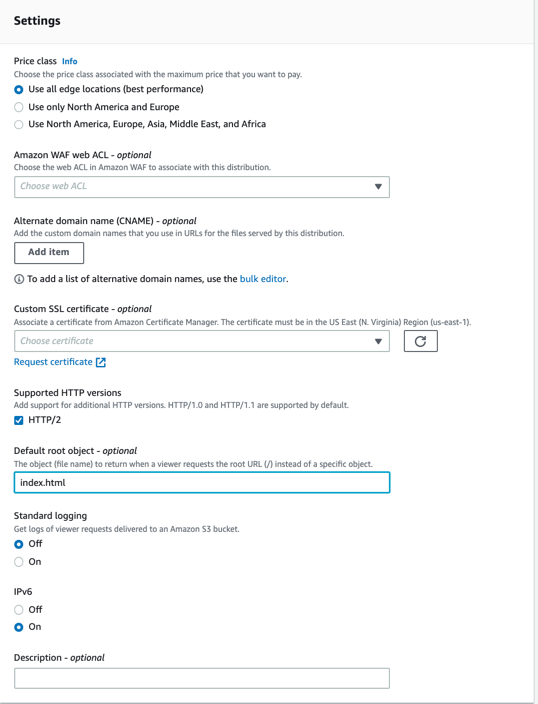

# Global content delivery with CloudFront

### Overview of CloudFront
When you are attempting to access a website your browser needs to first download the .html, .js, .css files from the server that hosts them. That server can be located in a certain place on the globe and users can be in a totally different place. Obviously, the further away a user is from the server, the higher the download latency.


"_Amazon CloudFront is a web service that speeds up distribution of your static and dynamic web content, such as .html, .css, .js, and image files, to your users. CloudFront delivers your content through a worldwide network of data centers called edge locations. When a user requests content that you're serving with CloudFront, the request is routed to the edge location that provides the lowest latency (time delay), so that content is delivered with the best possible performance._" [[doc](https://docs.aws.amazon.com/AmazonCloudFront/latest/DeveloperGuide/Introduction.html)]


[[source](https://www.ktexperts.com/amazon-cloudfront-in-aws/)]


### Set up a CloudFront distribution for the S3 bucket

#### Overview
* first you will need to create an S3 bucket, upload your files to it and make them publicly accessible
* create you CloudFront distribution and configure the S3 bucket as its source
* after it has been created CloudFront will output a domain name (something like `d111111abcdef8.cloudfront.net`)
* you will then use this domain to access your files instead of using the S3 domain (e.g. `d111111abcdef8.cloudfront.net/index.html`)
* CloudFront will route your request through the edge location closest to you and:
  * if it already has your file cached it will serve it
  * if it does not have the file cached it will retrieve it from the S3 bucket and cache it
* additionally, you can set up CloudFront to use your DNS (e.g. `myawesomeblog.com`)

#### Via Console
1. You should already have an S3 bucket configured for static website hosting but, if not, head over to `module-2` to find out how to do it. At this point you should be able to access your website via `http://<bucket-name>.s3-website-eu-west-1.amazonaws.com/`
2. Go to CloudFront service and click **Create a CloudFront distribution**

3. Select your S3 bucket as the origin domain and leave all other configurations as defaulted

4. Under the **Settings** section set the "Default root object" to **index.html**

5. Click **Create distribution**
6. It can take a few minutes for the distribution to distribute the configuration to all edges.
7. Once it is ready you can use the domain name to access your site

#### Via CLI
In order to create and configure a CloudFront distribution we need to use the `create-distribution` CLI command. [[doc](https://awscli.amazonaws.com/v2/documentation/api/latest/reference/cloudfront/create-distribution.html)]
```shell
chmod +x scripts/create-distribution.sh

./scripts/create-distribution.sh <bucket_name>
```

### Set up a DNS for the website

