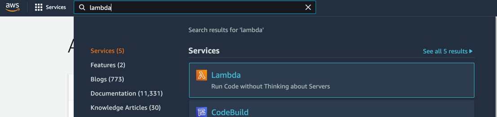
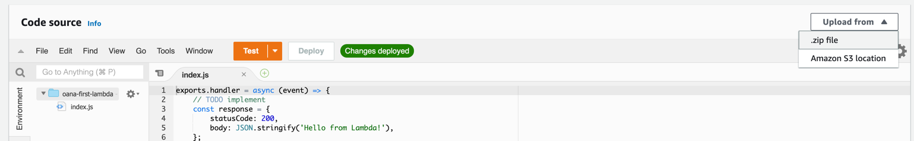

# Computing power with AWS Lambda
### Overview of AWS Lambda
Any serious application these days requires both a frontend and a backend. Most of the heavy computation and interaction with the database or other third-party apps happens in the backend. AWS provides a number of services that can be used for the backend side and **Lambda** is one of these.

"Lambda is a compute service that lets you run code without provisioning or managing servers. Lambda runs your code on a high-availability compute infrastructure and performs all of the administration of the compute resources, including server and operating system maintenance, capacity provisioning and automatic scaling, code monitoring and logging." [[doc](https://docs.aws.amazon.com/lambda/latest/dg/welcome.html)]

The interesting aspect of the Lambda service is that you don't reserve an entire server, not even a piece of a server, you only reserve computing power. Basically, some memory and CPU usage that your application needs. You can imagine you code being stored on a physical server somewhere and at some point receives a signal that it needs to execute your code. What you pay for are the resources the server had to allocate for your code to execute.  
### Creating a Lambda

#### Via Console
1. Go to the Lambda service and click on **Create a function**

2. Give your Lambda a name and leave all other configurations as default. You can use any programing language you want from the list, but this workshop will be using Node.

3. Click on **Create function**
4. Your Lambda function should have been created, and you can see in the console the code that it has by default.
```javascript
exports.handler = async (event) => {
    // TODO implement
    const response = {
        statusCode: 200,
        body: JSON.stringify('Hello from Lambda!'),
    };
    return response;
};
```
#### Via CLI
1. Create an execution role
```shell
chmod +x scripts/create-role.sh
./scripts/create-role.sh <lambda-name>
```
If this script executes successfully you should be seeing an output that looks like this:
```json
{
    "Role": {
        "Path": "/",
        "RoleName": "oana-cli-lambda",
        "RoleId": "<random-string>",
        "Arn": "arn:aws:iam::<ACCOUNT_ID>:role/oana-cli-lambda",
        "CreateDate": "2021-12-11T09:05:56+00:00",
        "AssumeRolePolicyDocument": {
            "Version": "2012-10-17",
            "Statement": [
                {
                    "Effect": "Allow",
                    "Principal": {
                        "Service": "lambda.amazonaws.com"
                    },
                    "Action": "sts:AssumeRole"
                }
            ]
        }
    }
}
```
You will need to copy the ACCOUNT_ID as we will be needing it for the next step.

2. Create the lambda function
```shell
chmod +x scripts/create-lambda.sh
./scripts/create-lambda.sh <lambda-name> <account-id>
```
### Uploading code to Lambda
Once a lambda was created you have the option of changing its code by uploading a new version of it.

#### Via Console
Under the **Code** section select **Upload from...**

Your code could be located on your local machine as a zip file or in an S3 bucket.

#### Via CLI
Go ahead and make a change to the `backend/index.js` file. The run the following commands:
```shell
chmod +x scripts/update-code.sh
./scripts/update-code.sh <lambda-name>
```
### Execute Lambda

#### Via Console
The AWS console offers the possibility of executing your lambda. This is very useful for testing and debugging your code before it starts being used by users.

In the **Code** section of your Lambda click on **Test**. The first time you do this it will ask you to create a test configuration that it will then use each time. Give you test configuration a name and leave the test event as it is. Click **Test** one more time and you will see the lambda being executed. At the end of the execution your Lambda will provide a report in which you can see the logs and the returned value.

#### Via CLI
```shell
chmod +x scripts/invoke-lambda.sh
./scripts/invoke-lambda.sh <lambda-name>
```
### Explore Lambda logs and metrics in CloudWatch
### Configure application server for handling HTTP requests

### Cleanup
Each created lambda has some extra resources that get created together with it so when you delete a lambda you also need to delete these. These are the log group and the execution role. So, in order to clean up a lambda function you need to:
1. Go to the Lambda service and delete the lambda
2. Go to the CloudWatch service, look for a log group with the name `/aws/lambda/<lambda-name>` and delete it
3. Go to the IAM service, under Roles, look for a role with the name `<lambda-name>-role-<random-string>` and delete it

