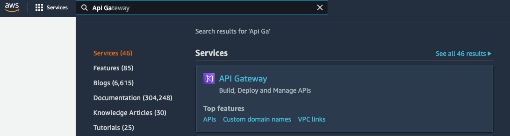

# Create an API with API Gateway
### Overview of API Gateway
"Amazon API Gateway is an AWS service for creating, publishing, maintaining, monitoring, and securing REST, HTTP, and WebSocket APIs at any scale." [[doc](https://docs.aws.amazon.com/apigateway/latest/developerguide/welcome.html)]

API Gateway provides a way for you to expose your backend via an API that can then be used by a frontend application. API Gateway is just the layer in front of your Lambda, EC2, ECS that provides the routes and the DNS of your API.

In this workshop we will be integrating API Gateway with Lambda. The result will be as depicted in the image bellow.


### Creating an API Gateway

#### Via Console
1. Go to API Gateway

2. Under **REST API** choose **Build** <br>

3. Configure as follows. You can use any API name you want.

4. Click on **Create API**
5. You should see a screen similar to this one

#### Configure a route and link it to a Lambda
Your API Gateway is now created, but it has no routes and it is not linked to any Lambda. In order to do that we need to go over the following steps.

**_Prerequisite_:**
You first need to create a Lambda. Details about how to do this can be found in [module-4](../module-4/README.md). Feel free to review that if you need to, but to speed things up we will be using the following commands.
```shell
chmod +x scripts/create-role.sh
chmod +x scripts/create-lambda.sh

./scripts/create-role.sh blog-posts-GET // get the ACCOUNT_ID
./scripts/create-lambda blog-posts-GET <ACCOUNT_ID> GET
```
You should see that a Lambda function with the name `blog-posts-GET` was created.

#### Via Console
1. From the **Actions** drop-down select **Create Resource**

2. Set the resource name and leave all other configuration as default

3. Click on the newly created resource and from the **Actions** drop-down select **Create Method**

4. Select GET <br>

5. Configure your method as follows and click **Save**

6. Once your API Gateway is configured you now have to deploy it. The changes will not be visible for external use unless you deploy. To do that select **Deploy API** from the **Actions** drop-down.

7. Next, give your stage a name and description and click **Deploy**.

8. You should now be able to see your API URL


To make sure your API is working open a browser tab and call `<API_URL>/blogposts`. You should see the array of blog posts in the response.
### Make an API call from website
