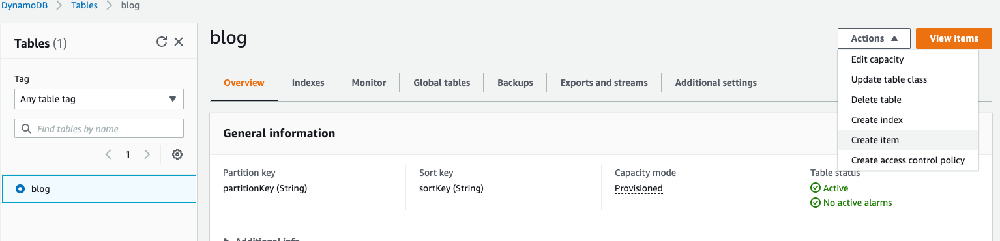

# Can’t do anything without a database. AWS RDS and DynamoDB

When it comes to databases there are two types that are most common: relational and non-relational (no-sql). AWS offers both options.

### Overview of RDS
Amazon Relational Database Service (Amazon RDS) is, as the name suggests, the service that offers access to a relational database in the cloud.

The database engines supported are:
* Amazon Aurora
* PostgreSQL
* MySQL
* Oracle
* MariaDB
* SQL Server

Amazon makes it convenient for developers to use their service because you only need to select an instance type and size and they will take care of things like scaling, backups, optimization of access, security and OS updates. 
### Overview of DynamoDB
"Amazon DynamoDB is a fully managed NoSQL database service that provides fast and predictable performance with seamless scalability. DynamoDB lets you offload the administrative burdens of operating and scaling a distributed database so that you don't have to worry about hardware provisioning, setup and configuration, replication, software patching, or cluster scaling." [[doc](https://docs.aws.amazon.com/amazondynamodb/latest/developerguide/Introduction.html)]

Similar to other databases, DynamoDB stores data in tables. Each table consists of rows (items) and columns (attributes). Similar to all no-sql databases the number of attributes of each item can vary from one to another. The only attributes that are required for each item are the ones that make up the primary key.

A DynamoDB table can have two types of primary key:
* **Partition Key** - the primary key is made up from a single attribute known as the _partition key_. A partition represents the actual physical storage place inside DynamoDB. The value of the partition key needs to be unique per item.
* **Partition Key and Sort Key** - the primary key is made up of two attributes. One is called a _partition key_ and the other a _sort key_. The partition key determines the partition in which the item will be stored and the sort key determines the order in which the items that are part of the same partition are stored. In this case the partition key does not have to be unique, but the combination of partition and sort keys does.

Database operations (insert, update, select, etc.) are handled different in no-sql databases than the relational ones. Even more so, in case of a DynamoDB the most common way is using HTTP cals to the service. The service has endpoints available to handle put, query, scan or delete. 
### Configure a DynamoDB

#### Via Console
1. Go to the DynamoDB service

2. Click on **Create Table**
3. Set the table name and primary key and leave all other configuration as defaulted.

4. Click **Create Table**

#### Via CLI
### Store and query for items in DynamoDB
#### Insert an item in the table
1. Click on the table name  

2. From the **Actions** menu select **Create item**

3. Set values for the partition and sort keys and add any other extra attributes

4. Click **Create Item**
#### Query items in a table
1. Click on **View items**

2. Now you have two options: scan or query. In situations in which you do not know exactly what your primary key value is you can use scan. It will read add the items in the table and try to find all of them that match with the filters you set. If you know the value of the primary key you should always use query since that will not read the entire table, so it is more efficient. You can only query based on the primary key.

### Call DynamoDB from Lambda
Let's now update our lambda to get the blog posts from the DynamoDB and remove the hardcoded list.

Before we do that we must make sure our lambda has access to DynamoDB. By default no service has access to any other service unless it is configured so. 

1. Go to the IAM service
2. Under **Roles** find the role of your lambda (blog-posts-GET)
3. Click on **Add inline policy**

4. Select the DynamoDB service and allow all read and write

5. Click **Review policy**
6. Give your policy a name (e.g. dynamo-db-read-write)
7. Click **Create policy**
